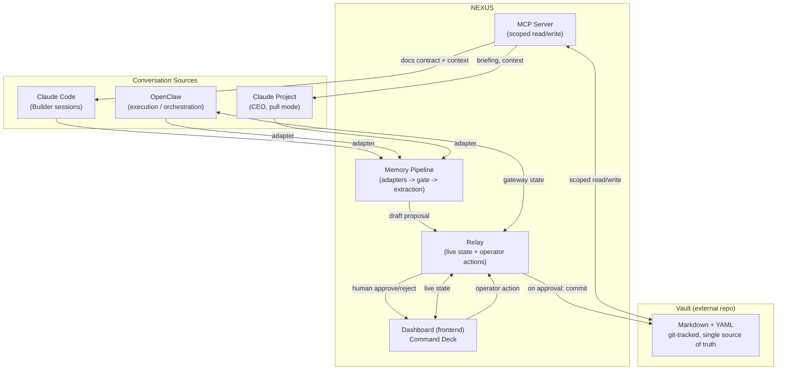
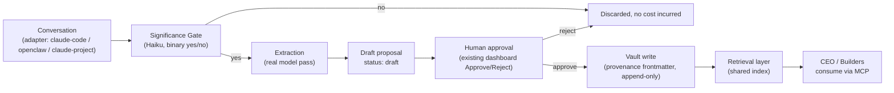
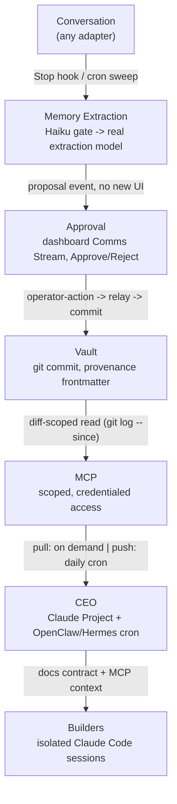

# NEXUS — Architecture Specification

This document is the versioned contract described in the roadmap's Phase 3:
the thing a Builder session with zero prior context should be able to read
and understand NEXUS from. It reflects the architecture as locked on
2026-08-07 ("NEXUS Brain v1.0"), plus a small number of explicitly-marked
additions where the locked decisions left a gap that a real specification
can't leave open.

**Reading key**, used throughout:

- **[LOCKED]** — an existing decision, already agreed, reproduced here for
  completeness. Not up for casual revision.
- **[PROPOSED]** — this document filling a gap the locked decisions left
  open (e.g. folder contents that were named but never specified). These
  are new judgment calls, flagged so they're easy to find and challenge.
- **[OPEN]** — a real unresolved blocker or unanswered question, carried
  forward rather than papered over.

---

## 1. Executive Summary

### What NEXUS is

NEXUS is a personal operating system for running a portfolio of ventures
(today: KrapMaps and Greenlit; tomorrow: whatever gets added) through a
combination of AI agents and a durable, human-legible memory of the
organisation itself. It is not a single app. It is three things working
together:

- **A memory** — a plain-text, git-tracked vault that is the single source
  of truth for decisions, knowledge, projects, tasks, and lessons across
  every venture.
- **An execution layer** — [OpenClaw](#7-agent-architecture), a
  self-hosted agent framework already running specialist crews.
- **A brain layer** — NEXUS itself: the conventions, workflows,
  integration points, and governance rules that let memory and execution
  work together without a human re-explaining context every time.

The dashboard (pixel-art "Command Deck") is the visible surface of this —
useful, but not the architecture. The architecture is the vault, the MCP
server, the memory pipeline, and the documented contract that lets
otherwise-disconnected agent sessions cooperate.

### Design philosophy

NEXUS is built on one governing observation: every part of it —
Claude Code Builder sessions, OpenClaw agents, the CEO — runs in a process
that has **no memory of any other process**. There is no shared RAM, no
shared session. The only thing that can coordinate them is what they can
all read: a filesystem, tracked in git, with a documented schema. That
constraint, taken seriously, is the whole design.

Everything else follows from it:

- If nothing can trust another process's memory, nothing should trust an
  agent's *unreviewed* output either — hence mandatory human approval
  before anything becomes organisational truth.
- If the vault is the one thing everyone can read, it must never be
  ambiguous about what's true — hence append-mostly writes, provenance on
  every object, and a locked frontmatter schema.
- If Builder sessions can't share memory with each other, the
  specification they *can* share (this document) has to be treated as
  load-bearing infrastructure, not optional documentation.

### Core architectural principles **[LOCKED]**

1. **Provider independence.** Do not architect around any single LLM
   vendor. The long-term target is a self-hosted AI operating system;
   Claude Projects and Claude Pro are today's interface, not a dependency.
2. **Consume, don't own.** NEXUS reads and writes the vault through a
   defined interface; it never duplicates or nests it. The same boundary
   applies to KrapMaps and Greenlit — NEXUS coordinates them, it doesn't
   absorb their repos.
3. **MCP is the integration layer.** Every future client — CEO, Builders,
   automations — talks to the vault through MCP, not bespoke APIs.
4. **Nothing becomes truth automatically.** All agent-proposed knowledge
   enters as a draft and requires human approval before it's permanent.
5. **Documentation is the substitute for shared memory.** Since Builder
   sessions don't share context, `nexus/docs/` is the actual integration
   mechanism between them, not an afterthought.
6. **Build the spine first.** Each phase is chosen so later phases get
   cheaper, not more expensive — the vault↔MCP↔briefing loop comes before
   any second agent crew, because everything after it plugs into that loop
   for free.
7. **Reuse before rebuild.** OpenClaw already is a working execution
   layer; the relay already is a working live-state bridge. NEXUS's job is
   to give them a brain, not to replace them.

---

## 2. Complete System Architecture

### High-level view



### Major components and responsibilities

| Component | Type | Responsibility | Owns | Does not own |
|---|---|---|---|---|
| **Dashboard** (`nexus/frontend`) | Web app (Next.js, Vercel) | Visualize live agent/org state; surface approvals | UI state, rendering | Canonical agent/org state |
| **Relay** (`nexus/backend`) | Node/Express + WebSocket | Hold canonical live-state snapshot; broadcast changes; round-trip operator actions | In-memory live state, the `/events` and `/operator-action` contract | Long-term memory (that's the vault's job) |
| **OpenClaw** | External, self-hosted | Run agent crews: cron, channels, plugins, workspaces | Agent execution, scheduling | Organisational memory, cross-venture coordination |
| **Vault** | External git repo | Single source of truth for organisational memory | All approved knowledge | Its own consumption logic (that's MCP's job) |
| **MCP Server** (`nexus/mcp`) | Service | Scoped, authenticated read/write interface to the vault | The integration contract | Vault content itself |
| **Memory Pipeline** | Service, spans `nexus/backend` + `nexus/mcp` | Turn conversation into vetted, provenance-tagged vault entries | The draft → approve → commit flow | The decision of what's "true" (that's the human's job) |
| **CEO** | Abstraction (Claude Project *and* OpenClaw/Hermes cron) | Strategic synthesis; daily briefing; eventually cross-venture prioritization | Nothing structurally — reads via MCP like any client | Execution (delegates to OpenClaw crews) |
| **Builders** | Isolated Claude Code sessions, one per product | Build NEXUS / Greenlit / KrapMaps respectively | Their own product's code | Each other's scope — never cross-build |

### Boundaries worth stating explicitly

- The **relay** and the **MCP server** are deliberately two different
  things with two different jobs, even though both mediate access to
  state. The relay is for *live, ephemeral, operational* state (is agent X
  currently active, does a proposal need a click) delivered over
  WebSocket. The MCP server is for *durable, queryable* organisational
  memory delivered on request. Collapsing them would couple a UI
  refresh-rate concern to a knowledge-retrieval concern — different access
  patterns, different consistency needs, different clients.
- **OpenClaw is not inside NEXUS**, and NEXUS is not inside OpenClaw. They
  are peers that communicate over the relay's documented HTTP/WS contract
  and (per the security model in §9) will eventually communicate over
  MCP for anything memory-related. Treating OpenClaw as "part of the
  NEXUS codebase" would violate principle #7 (reuse before rebuild) by
  inviting NEXUS to start patching around OpenClaw internals instead of
  its public interfaces.

---

## 3. Repository Architecture

### Layout **[LOCKED]**

```
nexus/
├── frontend/       (migrated from pixel-agent-ecosystem/web — the dashboard)
├── backend/        (migrated from pixel-agent-ecosystem/server — the relay)
├── mcp/            (new — vault MCP server; reads/writes an externally-configured vault path)
├── docs/           (this file and its siblings — the versioned contract)
├── agents/         (agent briefs — see below)
├── automations/    (schedule + approval-policy definitions — see below)
└── README.md
```

### Why each folder exists

| Folder | Reason |
|---|---|
| `frontend/`, `backend/` | Working code, migrated rather than rebuilt — Phase 0 exists precisely so this becomes true instead of aspirational |
| `mcp/` | The one mandated integration surface (principle #3); reads an externally-configured vault path — no ownership, no duplication |
| `docs/` | The substitute for shared memory between isolated Builder sessions (principle #5) |
| `agents/`, `automations/` | Named in the locked structure but never given internal contracts — specified below |

### `nexus/agents/` **[PROPOSED]**

The locked structure names this folder but never specifies its contents.
The existing precedent is `pixel-agent-ecosystem/agents/krapmaps-partnerships-scout.md`
— a single, complete, human-readable markdown brief per agent, pasted
directly as an OpenClaw agent's task/context. That pattern already works
and matches principle #7 (reuse, don't invent a new agent-definition
format). Proposal: keep it exactly as-is —

```
nexus/agents/
├── krapmaps-partnerships-scout.md
├── <next-agent>.md
└── ...
```

One markdown file per agent: standing context, recurring job, cadence,
output format, hard boundaries (what it may never do unsupervised). No new
schema needed — this is documentation the same way `docs/` is
documentation, just agent-scoped instead of architecture-scoped.

### `nexus/automations/` **[PROPOSED]**

Also named but unspecified. This folder is the place that answers "what
runs on what schedule, and what happens to its output" — distinct from
`agents/` (who the agent *is*) the way a crontab is distinct from the
program it runs. Proposal:

```
nexus/automations/
└── <automation-name>.md   # e.g. krapmaps-scout.md, daily-briefing.md
```

Each file states: which agent/process it runs, its OpenClaw cron
expression, what it's allowed to write (draft-only via the Memory
Pipeline, or nothing), and its approval requirement. This gives every
automation a single, greppable place that says "this exists, this is its
schedule, this is what happens to what it produces" — useful the moment
there are more than two or three of them, which Phase 4 onward guarantees.

### What stays external, and why

- **The vault** — its own repo, own git history, own pull schedule. Locked
  explicitly by the user after the assistant's first draft mistakenly
  nested it: "NEXUS consumes it; it does not own it." Nesting it would
  couple the vault's versioning lifecycle to NEXUS's codebase lifecycle —
  two things that should be free to evolve independently (the vault
  changes constantly from agent activity; the codebase changes on release
  cadence).
- **KrapMaps and Greenlit** — fully separate repos, each with its own
  Builder session. This is the direct consequence of the "Builders don't
  share memory" premise: if their code lived in one repo, nothing would
  actually enforce the isolation the Builder-session model depends on.

### Repository communication

Two channels, deliberately different in nature:

1. **Runtime**: MCP. This is how a running process (an automation, the
   CEO, a Builder's tools) gets *current data*.
2. **Design-time**: `nexus/docs/`. This is how a *new Builder session*,
   which has no runtime state at all yet, gets oriented. It's the
   substitute for the shared memory Claude Code sessions structurally
   cannot have.

Neither channel is optional — MCP without docs means every session
re-derives conventions by trial and error; docs without MCP means the
contract is accurate but nothing can act on it live.

### Migration status **[OPEN]**

As of this document, Phase 0 has only reached the audit stage: git status,
size check (`web/` 138M excluding `node_modules`), `.gitignore` and
secrets check (clean — only `.env.example` committed, no real secrets).
**No `nexus` repo has been created and no files have moved.** Two
production systems currently deploy from `krapmaps-stats` and will need
manual repointing once migration happens: the dashboard (Vercel project
settings) and the relay (Hetzner box, `git pull` + pm2) — repointing is
explicitly a human action, sequenced so neither goes down mid-migration.

---

## 4. Vault Architecture

### What it is **[LOCKED]**

Plain Markdown with YAML frontmatter, tracked in git. Obsidian is the
preferred *viewer*, never a dependency — nothing in the architecture may
assume Obsidian-specific storage or plugins. One shared vault across every
venture: "Greenlit and KrapMaps are domains inside the same organisation.
Cross-business knowledge is intentional."

### Folder structure **[PROPOSED]**

Only two folders were ever named in the locked design (`Briefings/`, and
`Funding & Partnerships/` for the KrapMaps scout's output) — not a full
taxonomy. Rather than invent an arbitrary one, this proposal derives the
top-level structure directly from the already-locked provenance `type`
enum, so the filesystem and the schema can never drift apart:

```
vault/
├── Decisions/
├── Knowledge/
├── Projects/
├── Tasks/
├── Roadmap/
├── Lessons/
├── Briefings/                    # CEO daily briefing output
└── <Venture>/                    # KrapMaps/, Greenlit/, ... — domain-scoped findings
    └── Funding & Partnerships/   # e.g. KrapMaps scout output
```

A note's `type:` frontmatter field determines its top-level folder
one-to-one; venture-scoped agent output nests under the relevant venture
folder instead, since that content is naturally domain-specific rather
than organisation-wide. This is a filing convention, not a new piece of
architecture — it makes an existing schema field double as a directory
index, which is the cheapest possible taxonomy to keep consistent.

### Frontmatter / provenance schema **[LOCKED]**

Every memory object entering the vault through the Memory Pipeline carries
this exact schema:

```yaml
---
type: decision | knowledge | project | task | roadmap | lesson
status: draft | approved | rejected
source: claude-code | openclaw | claude-project
timestamp: <ISO 8601>
originating_session: <session id>
originating_agent: <agent/human id>
confidence: low | medium | high
approved_by: null
approved_at: null
---
```

The organisation should always be able to answer "where did this
knowledge come from" from the frontmatter alone.

### Memory model and lifecycle **[LOCKED, with one proposed addition]**

Notes enter as `status: draft`, are proposed through the relay's existing
Approve/Reject mechanism (no new UI), and only become permanent
organisational memory on human approval. The pipeline is directed to
**only ever add new notes, never edit existing ones** — this preserves
the single-source-of-truth guarantee by making the vault an append log
rather than a mutable database anyone could quietly rewrite.

**[PROPOSED]** — append-only has a real cost the locked design doesn't yet
address: a superseded decision's note remains in the vault indistinguishable
from a still-true one, unless something marks the relationship. Over a
multi-year horizon (see §13) this becomes actively misleading rather than
just untidy. Proposal: add two optional frontmatter fields —

```yaml
supersedes: <note id or path>
superseded_by: <note id or path>
```

— populated when a new decision explicitly revises an old one. This adds
a link, not a mutation: the append-only guarantee holds, but a reader (or
the CEO synthesizing a briefing) can now tell current truth from history.
This is a minimal extension of the existing schema, not a redesign of the
vault — consistent with the v1.0 instruction not to redesign it.

### Location **[OPEN — the single largest blocker in this document]**

Where the real vault currently lives, and whether it is already
git-tracked, was never established anywhere in the design process. It was
raised and re-raised as the one dependency everything else in Phase 1A
sits on top of, and the v1.0 instruction that started Phase 0 ("do not
redesign the vault") did not answer it. **This should be resolved before
any Phase 1A implementation work starts** — every other item in this
section is a specification for a system that, as of this document, has
nowhere to write to. The fallback discussed and not yet acted on: stand up
a throwaway test vault repo to prove the pipeline end-to-end, then repoint
it once the real location is known.

---

## 5. MCP Architecture

### Server responsibilities **[LOCKED]**

A single MCP server exposing the vault to every downstream client — the
mandated replacement for bespoke per-client APIs. Phase 1A scope is read
access; the Memory Pipeline (Phase 1C) additionally requires a write path
for the approval-completion step.

### Read model **[LOCKED]**

Reads are scoped, not full-vault, specifically to bound token cost as the
vault grows:

- Diff-based reads: `git log --since=<last read> --name-only` against the
  vault repo returns exactly what changed.
- Plus a small, fixed set of "pinned" always-relevant notes (e.g. current
  roadmap, standing context) that don't depend on recency.

This keeps a client's per-call cost roughly constant instead of scaling
with vault size.

### Write model **[LOCKED, scope narrowed — see security]**

Writes happen through the same MCP layer, not direct filesystem access
from any client — the daily briefing write-back and the Memory Pipeline's
vault-commit step both route here. Writes are always structured commits
carrying the full provenance frontmatter; there is no "edit" operation,
only "append."

### Security **[OPEN in the locked design — proposal below]**

This is the one area the design process never addressed at all: no
auth scheme, token model, or access-control mechanism for the MCP server
itself was ever specified — only *what* it may read or write (vault path,
diff-scoped reads, no edits) was designed. That's a real gap relative to
the relay, which has an explicit shared-secret model. **[PROPOSED]**
resolution, deliberately mirroring the pattern that already works for the
relay rather than inventing a new one:

- Each MCP client (CEO Project, each Builder, each automation) authenticates
  with its own scoped credential — not one shared secret for every
  consumer, unlike the relay's simpler single-secret model, because MCP
  clients have meaningfully different privilege needs.
- Read scope is per-credential: a Builder's credential can read
  `nexus/docs/` and its own venture's vault slice; it does not need
  (and should not have) blanket read access to every other venture's
  notes, even though the vault is logically shared.
- **Vault write capability is restricted to one trusted service identity**
  — the Memory Pipeline's approval-completion step — never granted
  generally to CEO, Builder, or automation credentials directly. This
  means "can this client read the vault" and "can this client cause a
  permanent vault write" are different questions with different answers,
  which is the actual enforcement mechanism behind principle #4 (nothing
  becomes truth automatically). Without this separation, principle #4 is
  a convention any MCP client could bypass; with it, bypassing requires
  compromising the one write-capable identity, not just calling an
  API differently.
- Every read and write is logged with client identity + timestamp — the
  audit trail principle already applied to memory provenance, extended to
  the access layer itself (see §9).

### Client model **[LOCKED]**

- **CEO** — read-mostly (scoped diff + pinned notes) plus the daily
  briefing write-back.
- **Builders** — read the docs contract plus their own venture's relevant
  vault slice; never write directly.
- **Automations/agents** — read for context; write only indirectly, via
  the Memory Pipeline's draft → approval path, never a direct MCP write.

---

## 6. Memory System

### The pipeline **[LOCKED]**



### Save filter **[LOCKED]**

Auto-save candidates: new architectural decisions, accepted plans,
completed projects, genuinely new knowledge, strategy changes, SOPs,
important lessons, product milestones, new integrations, significant
customer insight.

Never auto-save: routine chat, debugging back-and-forth, "maybe we
should...", temporary ideas, repeated explanations, small talk.

### Adapters **[LOCKED]**

Every conversation source is an adapter feeding the *same* pipeline; the
pipeline itself stays implementation-agnostic. Named adapters: Claude
Code, OpenClaw, Claude Project, future LLM clients. This is what makes
"multiple memory sources" a configuration fact rather than a rewrite —
new adapter, same downstream pipeline.

### Significance gate **[LOCKED]**

A cheap, fast model call (Haiku) answers one binary question — "does this
look like a decision, completed task, or new fact worth remembering?" —
before the expensive extraction model ever runs. This exists purely to
keep per-message extraction from becoming an unbounded, compounding hit
to a single Claude Pro budget.

### Shared retrieval layer **[LOCKED]**

Duplicate detection and context retrieval are treated as the same
problem, served by one shared indexing layer — not two independently
built silos. A "Memory Service" doing dedup and a "Context Service"
building briefing context both consume this layer rather than each
maintaining their own matching logic.

**[PROPOSED, extending this for scale]** — git-grep and file listing are
sufficient at today's vault size but will not stay sufficient
indefinitely (see §13). The retrieval layer should be architected from
the start as a **rebuildable cache over the vault**, not a second source
of truth: an embedding/keyword index that can be deleted and regenerated
from git history at any time. This keeps git+markdown as the only durable
state (consistent with "do not redesign the vault") while giving the
system room to add real semantic search later without a data-migration
event — the index is disposable, the vault is not.

### Human approval **[LOCKED]**

Extraction always produces a `status: draft` proposal, never a direct
write. Approval reuses the dashboard's existing Comms Stream pattern —
the only new backend work is extending the relay's operator-action
handler so that approving *this* proposal kind triggers a vault write
instead of a generic "resolved" broadcast.

### Provenance **[LOCKED]**

Every memory object records source, timestamp, originating session,
originating agent, confidence, and approval status — see the schema in
§4. This is the mechanism, not a policy statement: the org can always
answer "where did this come from."

### Delivery strategy: one adapter first **[LOCKED]**

The first implementation is scoped to exercise the *entire* pipeline with
exactly one adapter — a Claude Code Stop hook on the Builder session doing
this work — rather than building all four adapters up front. Concretely:
Stop hook fires → Haiku gate → extraction into one of six categories →
`proposal` event posted to the relay (no new UI) → human clicks Approve
→ relay's extended operator-action handler commits the note with
frontmatter → for this slice, "the CEO reads it" is scoped down to a
human manually confirming the note is well-formed in the vault; the fully
automated daily-briefing read side is deliberately deferred to Phase 1B
rather than built to satisfy this one proof.

**[OPEN]** — none of Phase 1C has been implemented yet; it was the very
next planned unit of work when v1.0 was declared and direction shifted to
Phase 0.

---

## 7. Agent Architecture

### CEO **[LOCKED]**

An abstraction, not a fixed product, deliberately implemented two ways at
once rather than either/or:

- **Pull mode, near-term**: a Claude Project for interactive strategic
  conversation. Good for ad-hoc consultation; has no scheduling, no
  autonomous execution, no arbitrary tool access, and requires the human
  to open and drive it.
- **Push mode, long-term**: OpenClaw/Hermes as the proactive executive
  layer — cron-scheduled, capable of unprompted messages, acting without
  the human present.

Both are meant to read the same underlying vault via the same MCP
surface, so they stay consistent with each other by construction rather
than by manual syncing.

### Builders **[LOCKED]**

Separate Claude Code sessions, one per product, explicitly walled off:
NEXUS Builder builds only NEXUS; Greenlit Builder (future) builds only
Greenlit; KrapMaps Builder (future) builds only KrapMaps. Since these
sessions share no memory, `nexus/docs/` is the only thing that keeps them
mutually consistent — this is the direct, practical reason Phase 3
(the docs contract) is sequenced *before* Phase 5 (Greenlit integration):
onboarding a second Builder without the contract in place would mean it
has nothing reliable to read.

### OpenClaw **[LOCKED]**

The execution/orchestration layer. Runs specialist agent crews, one per
business/project. NEXUS does not reimplement any of this — cron,
channels, plugins, and workspaces are treated as existing, working
infrastructure NEXUS builds on top of, not around.

### Hermes **[LOCKED, with a naming risk flagged]**

Not a product to install — a **role name** for the future
manager/chief-of-staff sitting above individual OpenClaw crews, one level
up from "specialist agent per business." Explicit sequencing: build one
real OpenClaw crew first; only introduce the Hermes coordinator role once
two or more crews genuinely exist to coordinate. In the roadmap this is
Phase 6: CEO is promoted from a cron job doing a briefing into a
dedicated coordinator reading across all automations via the same MCP
layer, able to prioritize and delegate rather than just summarize — the
Claude Project becomes a complement at that point, not a placeholder
waiting to be replaced.

A rejected shape worth recording precisely because it's the tempting
wrong answer: **Hermes as a lead agent delegating directly into
OpenClaw's own worker agents.** Rejected because it stacks two
orchestration frameworks with no shared context, creates a permanent
fragility tax in glue code, adds a second reasoning layer's worth of
token cost on top of the workers it's delegating to, and is premature
before any working crew exists. The accepted shape has Hermes coordinate
the *human's* priorities across domains from above OpenClaw, never
reaching into OpenClaw's own internal lead→worker delegation, which
OpenClaw already does natively.

**[PROPOSED]** — "Hermes" is also the name of a real, unrelated
open-source project (Nous Research's Hermes Agent, MIT-licensed, built
around persistent cross-session memory). The two are independent designs
with different centers of gravity and no shared code, but the name
collision is a real confusion risk once this is documented publicly or
referenced in commit messages/READOs. Worth a deliberate rename (or an
explicit disambiguating note wherever "Hermes" appears) before Phase 6,
rather than after someone conflates the two.

### KrapMaps Partnerships & Funding Scout **[LOCKED]**

A complete OpenClaw agent brief already committed at
`pixel-agent-ecosystem/agents/krapmaps-partnerships-scout.md`, not yet
deployed as a running job. Scans for grants, partnerships, and investors
fitting KrapMaps, twice weekly. Hard boundaries baked into the brief
itself: never sends outreach unsupervised, always drafts for human
review; never surfaces the founder's personal details externally; flags
warm-intro opportunities but never contacts them directly. In the
roadmap this is Phase 4, and its output is directed to route through the
same Memory Pipeline draft-proposal mechanism as Phase 1C rather than
writing to the vault directly — free consistency, no extra integration
work, once the pipeline exists.

### Future agents **[LOCKED as backlog, not commitments]**

`AGENT_IDEAS.md` holds a running backlog (clip/shorts cutter, digital
product scout, VWAP+EMA trading-signal research agent, competitor watch,
morning brief, inbox triage, and others) explicitly framed as "a holding
pen, not a task list." None are scheduled; they exist so ideas aren't
lost, not so they're implicitly promised.

---

## 8. Automation Architecture

### Scheduling **[LOCKED]**

OpenClaw exposes two mechanisms, deliberately used for different things:

- **Heartbeat** (fires every 30 minutes, reads `HEARTBEAT.md` if present)
  — an existing trigger, judged the wrong cadence for anything that should
  happen once a day.
- **Cron** (`openclaw cron add/list/run/status`) — the correct mechanism
  for scheduled jobs: the daily briefing and the twice-weekly KrapMaps
  scout both belong here, not on the heartbeat.

### Event-driven workflows **[LOCKED]**

Memory writing is significance-gated rather than firing on every message
(§6) — explicitly chosen over naive "write immediately whenever something
significant happens" because true per-message extraction is a compounding
LLM cost the design deliberately avoids. The relay's operator-action
round trip is the other standing event-driven mechanism: a human click
resolves a pending item and rebroadcasts the resolution to every
connected dashboard.

### Human approval points **[LOCKED — enumerated here for completeness]**

- Every memory-pipeline draft (decision/knowledge/project/task/roadmap/
  lesson) before it becomes permanent.
- Every KrapMaps scout outreach draft, application, or email — always
  drafted, never sent autonomously.
- Every error-alert Retry/Terminate action on the dashboard.
- Any warm-intro contact opportunity the scout surfaces — flagged, never
  actioned by the agent.

The pattern is consistent on purpose: agents draft, humans decide,
anywhere the outcome is hard to reverse or externally visible.

### Failure recovery **[LOCKED where it exists, OPEN where it doesn't]**

What exists today is at the dashboard/relay level: every relay event
handler falls through to a safety-net logger rather than crashing on a
malformed or unexpected payload, and the outer event switch has a default
case for unrecognized event names — verified by inspection and a live
test, no unguarded property access. Paused/error/rate-limited agents are
visually distinct on the dashboard and Retry/Terminate exist as first-class
actions.

**[OPEN]** — no equivalent failure-recovery design exists yet for the
Memory Pipeline or MCP server: what happens if a vault write fails
mid-commit, or the significance gate call errors out, was never
specified. **[PROPOSED]** minimal pattern, reusing existing mechanisms
rather than inventing new ones: pipeline-step failures emit a `log` event
of kind `error` to the relay's existing feed (the exact mechanism already
used for OpenClaw errors, no new plumbing required), and a failed vault
commit blocks the approval from completing — surfaced back to the human
as a retry rather than silently discarding the approved draft. This keeps
the failure path visible in the one place a human is already watching,
instead of adding a second, separate error-reporting surface.

### Cost/capacity guidance **[LOCKED]**

The design consistently bounds automation frequency to what a single
Claude Pro subscription can sustain: a small number of scheduled
check-ins per day per agent is sustainable; continuous/always-on agent
work is not, and would require a metered API or Max-tier billing change
instead of a code change. This is why the scout runs twice weekly rather
than daily, and why the significance gate exists at all.

---

## 9. Security Model

### Trust boundaries

| Boundary | Mechanism | Status |
|---|---|---|
| Dashboard ↔ Relay | Shared secret (`RELAY_INGEST_SECRET`), header or query param | **[LOCKED, implemented]** |
| Relay ↔ OpenClaw Gateway | Gateway token auth; loopback-only by default | **[LOCKED, implemented]** |
| MCP ↔ clients | Per-client scoped credentials, write restricted to one service identity | **[PROPOSED — see §5]** |
| Vault repo access | Host-level git/SSH | **[OPEN — not specified]** |
| OpenClaw privileged commands | Command-owner allowlist | **[OPEN — flagged by OpenClaw's own audit, not yet configured]** |

### Permissions

The vault's real access-control mechanism, today, is social/architectural
rather than cryptographic: append-only writes plus mandatory human
approval is what stops anything from becoming truth unreviewed. That's
sufficient for a single-operator system but is explicitly **not** a
multi-user permission model — cross-business access control inside the
vault ("can a KrapMaps automation see Greenlit's notes") is deferred as
"a future concern, not a current one," which is fine today and worth
revisiting the moment a second human operator enters the picture.

### Audit logging

Provenance frontmatter already functions as an audit trail for memory
content. **[PROPOSED]** — extend the same principle one layer down, to
access rather than content: every MCP read and write logged with client
identity and timestamp, so "who touched the vault and when" is answerable
the same way "where did this knowledge come from" already is.

### Inherited risk from OpenClaw **[OPEN]**

OpenClaw's own security audit (`openclaw doctor`) surfaced findings that
remain unresolved as of this document and become NEXUS's problem the more
it leans on OpenClaw as its execution layer:

- No command-owner configured — privileged commands are ungated (DM
  pairing lets someone talk to the agent; it does not make them the
  owner for privileged actions).
- `gateway.auth.token` stored in **plaintext** in `openclaw.json` — a
  migration path to SecretRefs exists and is unused.
- Memory-search provider configured to `"openai"` with no API key set (a
  live misconfiguration, not itself a leak, but worth fixing before it's
  relied on).

None of these block Phase 0–3, but all three should close before NEXUS
depends on OpenClaw for anything beyond dashboard visualization —
otherwise NEXUS's own governance model (approval-gated writes, provenance)
sits on top of an execution layer with a known-open privilege-escalation
path.

### Secrets hygiene **[LOCKED, verified]**

Both `web/` and `server/` `.gitignore` files correctly exclude
`node_modules` and `.env`; only `.env.example` (template, no real values)
is committed. Confirmed via direct audit — no secrets tracked anywhere in
`pixel-agent-ecosystem/`.

---

## 10. Data Flow

The canonical flow, as specified, with the concrete mechanism at each
step:



Each arrow is a real, specified mechanism, not a conceptual placeholder:
extraction is gated before it runs (cost control); approval reuses an
existing UI pattern (no new surface); the vault write is append-only with
schema (§4); MCP reads are diff-scoped (bounded cost, §5); CEO consumption
splits pull (Project) and push (cron briefing); Builders receive context
indirectly, through the documented contract plus their own MCP-scoped
reads, never through direct access to another Builder's session.

---

## 11. Risks

Ranked roughly by how much they block near-term work versus how far out
they bite.

1. **Vault location is still unknown.** [§4] This has been the single
   open blocker through the entire design process and directly blocks
   Phase 1A. Nothing downstream (MCP, briefing, memory pipeline) can be
   implemented against a real vault until this closes.
2. **MCP has no designed security model.** [§5] The relay got one; MCP
   didn't. Left unresolved, the first real MCP client would either ship
   without auth or improvise one under time pressure — worse than
   designing it now, deliberately, as §5 proposes.
3. **The relay is a single point of failure** for both live dashboard
   state and the operator-action approval path. No redundancy or restart
   strategy was ever discussed. Today's blast radius (one dashboard, one
   operator) makes this tolerable; it stops being tolerable the moment
   approvals gate something with real time-sensitivity (e.g. a funding
   deadline the scout surfaces).
4. **Append-only vault, no supersession marker** [§4]. Left as-is, the
   vault accumulates decisions that read as current but aren't, with
   nothing distinguishing them — actively misleading over a multi-year
   horizon, not just untidy. §4 proposes `supersedes`/`superseded_by`
   fields as a minimal fix.
5. **The docs contract is a convention, not an enforcement mechanism.**
   Nothing stops a Builder session from silently ignoring
   `nexus/docs/` and drifting. The entire cross-Builder coordination
   model rests on Builders actually reading and respecting a document —
   worth treating as a standing assumption to periodically re-verify,
   not a guarantee.
6. **Provider-independence principle vs. current OpenClaw auth.**
   Principle #1 says don't architect around one vendor; OpenClaw today
   authenticates via a specific Claude Pro subscription, which is a real
   dependency, not an abstraction. This isn't a contradiction to fix
   immediately — it's a gap between the stated principle and the current
   implementation that should be named rather than left implicit (see §13
   for the resolution path).
7. **Inherited OpenClaw security findings** [§9] — plaintext gateway
   token, no command-owner allowlist. Low blast radius today (single
   operator, self-hosted), higher the more the execution layer is trusted
   with consequential actions.
8. **Cost/rate-limit coupling to a single subscription.** Every cadence
   decision in this document (twice-weekly scout, gated extraction, a
   handful of daily check-ins) is calibrated to one Claude Pro budget.
   Scaling agent count or frequency is a billing decision before it's a
   code decision — worth remembering before promising a faster cadence
   than the current plan supports.
9. **"Hermes" naming collision** [§7] with the real Nous Research
   project — a documentation/confusion risk, not a technical one, but one
   that gets more expensive to fix the more it's referenced publicly.
10. **Git-as-datastore won't scale indefinitely for retrieval.** [§6]
    Fine today; the proposed rebuildable-index layer is the intended
    relief valve, but it doesn't exist yet and isn't urgent until vault
    size or query complexity actually demands it.

---

## 12. Alternatives Considered and Rejected

Recorded because the reasoning is as much a part of the specification as
the decision — a future reviewer should be able to see why the road not
taken was rejected, not just that it was.

| Alternative | Rejected because |
|---|---|
| Bespoke REST API per client instead of MCP | Multiplies integration surfaces with no shared auth/scope model; every new client would mean a new API rather than a new credential |
| Fully event-driven extraction on every message, no gate | Unsustainable, compounding LLM cost on a single Claude Pro budget |
| NEXUS builds its own agent framework | OpenClaw already works — cron, channels, plugins, workspaces are real and running; a second framework inside NEXUS would duplicate solved problems |
| Hermes as lead agent delegating directly into OpenClaw's worker agents | Two frameworks, no shared context, permanent glue-code fragility, an extra reasoning layer's token cost, and premature with zero working crews to coordinate |
| Vault nested inside `nexus/` repo | Breaks the consume-don't-own boundary; couples two independently-versioned things (the fast-changing vault, the release-paced codebase) |
| Unsupervised auto-write of extracted memory | Unacceptable trust risk — an LLM deciding unsupervised what counts as organisational truth, with no correction path |
| Independent Memory Service and Context Service, each with its own dedup logic | Duplicates retrieval/embedding infrastructure that both actually need; merged into one shared retrieval layer instead |
| Piggybacking daily jobs on OpenClaw's 30-minute heartbeat | Wrong cadence granularity; cron is a purpose-built separate mechanism already available |

---

## 13. Five-Year Evolution

The intent throughout this specification is that growth adds layers
rather than replacing them — the storage substrate (git + markdown), the
integration surface (MCP), and the execution layer (OpenClaw) are each
meant to still be exactly what they are today, five years from now, just
with more built on top. What follows is not a committed roadmap beyond
the locked Phase 0–7 (§ roadmap already exists in `nexus/docs/roadmap.md`
once Phase 3 produces it) — it's the shape the architecture is built to
grow into without a rewrite.

**Year 0–1 — Foundation (Phases 0–3).** Repo scaffold; vault + MCP
online (once the location blocker closes); daily briefing as first real
client; the memory pipeline proven end-to-end with one adapter; the docs
contract written. Everything after this point is additive.

**Year 1–2 — Proof of generality (Phases 4–5).** A second automation
(KrapMaps scout) and a second Builder (Greenlit) come online using
nothing but the existing MCP surface and the docs contract — no new
integration mechanism. If either requires inventing something new to
onboard, that's a signal principle #3 (MCP as the only integration layer)
didn't actually hold and needs revisiting; if not, it's confirmation the
foundation generalizes.

**Year 2–3 — Coordination (Phase 6).** CEO graduates from a cron job that
summarizes into a Hermes-style coordinator that prioritizes and delegates
across multiple running automations, still strictly human-approved for
anything consequential. This is where the retrieval layer proposed in §6
stops being optional — cross-venture prioritization needs real semantic
retrieval over a vault that's now multiple businesses deep, not just file
listing.

**Year 3–4 — Hardening.** MCP auth (§5) and OpenClaw's own security
findings (§9) close, not because anything failed but because the blast
radius of both has grown from "one operator's dashboard" to "the thing
several ventures' agents depend on." This is also the natural point to
resolve the provider-independence tension named in risk #6: OpenClaw's
execution layer gains a real provider-abstraction boundary (still
self-hosted, still Claude by default) so principle #1 stops being
aspirational.

**Year 4–5 — Self-hosted operating system.** The Claude Project CEO
interface — always described as "a temporary interface, not a
dependency" — is retired in favor of a NEXUS-native surface reading the
same MCP/vault substrate, closing the last gap between the stated
long-term target and the actual system. Whether the human-approval gate
(principle #4) ever relaxes for narrow, well-established categories of
low-stakes memory is a live question worth revisiting at this point —
but it is explicitly **not** a decision this document makes; today,
nothing becomes truth automatically, full stop.

**Why no major rewrite is needed to get there:** every year above adds a
layer on top of something that doesn't change — the vault stays git +
markdown, MCP stays the only integration surface, OpenClaw stays the
execution layer. The only thing that grows is what's built against those
three constants: more adapters, more automations, more Builders, a
richer retrieval layer, a hardened auth model. None of that requires the
constants themselves to move.
